# Backend Architecture

ACP Agent Workbench의 Rust/Tauri 백엔드는 hexagonal(ports-and-adapters) 스타일로 구성되어 있다.

이 문서는 각 레이어의 책임, 허용되는 의존 방향, 그리고 새 기능을 추가할 때 어디에 코드를 두어야 하는지를 정리한다.

## 레이어

```mermaid
flowchart LR
    subgraph domain["domain/"]
        direction TB
        events[events.rs]
        run[run.rs]
        agent[agent.rs]
    end

    subgraph ports["ports/"]
        direction TB
        session_registry[session_registry.rs]
        session_handle[session_handle.rs]
        event_sink[event_sink.rs]
        permission[permission.rs]
        agent_catalog[agent_catalog.rs]
        goal_file[goal_file.rs]
    end

    subgraph application["application/"]
        direction TB
        start_agent_run[start_agent_run.rs]
        send_prompt[send_prompt.rs]
        cancel_agent_run[cancel_agent_run.rs]
        list_agents[list_agents.rs]
        load_goal_file[load_goal_file.rs]
        respond_permission[respond_permission.rs]
    end

    subgraph adapters["adapters/"]
        direction TB
        tauri_cmd["tauri/commands.rs"]
        tauri_sink["tauri/event_sink.rs"]
        session_reg_impl["session_registry.rs"]
        perm_broker["permission_broker.rs"]
        acp_runner["acp/runner.rs"]
        acp_client["acp/client.rs"]
        acp_transport["acp/transport.rs"]
        acp_mapper["acp/session_update_mapper.rs"]
        agent_cat_impl["agent_catalog.rs"]
        fs_impl["fs.rs"]
    end

    ports --> domain
    application --> ports
    application --> domain
    adapters --> application
    adapters --> ports
    adapters --> domain
```

## 의존 방향

`domain → ports → application → adapters`가 단 하나의 허용되는 방향이다.

| Layer | 의존 가능 | 의존 불가 |
|---|---|---|
| `domain/` | (없음) | `ports`, `application`, `adapters` |
| `ports/` | `domain` | `application`, `adapters` |
| `application/` | `domain`, `ports` | `adapters` (원칙적으로. 클로저 주입으로 adapter 타입이 유출되지 않게 한다) |
| `adapters/` | `domain`, `ports`, `application` | — |

요지:
- **domain**은 순수 데이터 타입과 도메인 규칙만 들고 있어야 한다. Tauri / JSON-RPC / subprocess / 파일시스템 경로 구체에 의존하지 않는다.
- **ports**는 application이 외부세계에 요구하는 최소 인터페이스만 정의한다. 어댑터 구현 세부사항을 따라가지 않는다.
- **application**은 유스케이스 오케스트레이션을 소유한다. `SessionRegistry`, `SessionHandle`, `RunEventSink` 같은 포트를 통해 일한다. 테스트에서는 fake port로 대체 가능.
- **adapters**는 포트를 구현하면서 Tauri, ACP JSON-RPC, subprocess, 파일시스템, 권한 결정 등 외부 프로토콜을 격리한다.

이 방향은 CI에서 `npm run check:backend-boundaries`로 검사한다. 검사는 `src-tauri/src/{domain,ports,application}`의 Rust `use crate::...` 경로를 확인하며 다음 역방향 의존을 실패 처리한다.

- `domain` → `ports`, `application`, `adapters`
- `ports` → `application`, `adapters`
- `application` → `adapters`

검사 스크립트는 `scripts/check-backend-boundaries.mjs`에 있으며, 파서 자체의 기본 동작은 `npm run check:backend-boundaries:self-test`로 확인할 수 있다.

## 주요 포트

| 포트 | 책임 |
|---|---|
| `SessionRegistry` | run id 예약/중복/동시성 한도 관리, task handle / session handle 보관, 취소 |
| `SessionLauncher` | 세션 1건 기동. 성공 시 `LaunchedSession { session, commander }` 반환. `RunCommander`는 `run_to_completion` 또는 `abort` 중 하나만 소비 (Command/Strategy 패턴) |
| `SessionHandle` | 활성 세션에 follow-up 프롬프트 전송 (AcpSession의 ACP 의존성을 숨긴다) |
| `RunEventSink` | 특정 run id의 `RunEvent`를 외부 세계(예: 프런트엔드)로 내보냄 |
| `PermissionDecisionPort` | 권한 대기열 생성/응답 |
| `AgentCatalog` | 가용 에이전트 목록과 기본 커맨드 조회 |
| `GoalFileReader` | 디스크의 goal 파일 로드 |

## 주요 유스케이스

| UseCase | 입력 | 핵심 작업 |
|---|---|---|
| `StartAgentRunUseCase` | `AgentRunRequest`, sink, `SessionLauncher` | run 예약 → 세션 launch → attach → driver await → finish |
| `SendPromptUseCase` | run id, prompt, sink | 활성 세션 조회 → `SessionHandle::send_prompt` → 에러를 이벤트로 surface |
| `CancelAgentRunUseCase` | run id, sink | registry cancel 호출 + `Cancelled` 라이프사이클 이벤트 emit (미존재 run도 fallback 메시지로 emit) |
| `ListAgentsUseCase` | — | `AgentCatalog` 조회 |
| `LoadGoalFileUseCase` | 경로 | `GoalFileReader` 조회 |
| `RespondPermissionUseCase` | permission id, option id | `PermissionDecisionPort::respond` |

## 주요 어댑터

| Adapter | 구현 포트 / 역할 |
|---|---|
| `adapters/session_registry.rs::AppState` | `SessionRegistry` 구현. 내부에 `PermissionBroker` 소유 |
| `adapters/permission_broker.rs::PermissionBroker` | `PermissionDecisionPort` 구현 |
| `adapters/acp/runner.rs::AcpAgentRunner` | ACP agent subprocess 기동 + 세션 생성. `SessionLauncher`를 직접 구현한다. |
| `adapters/acp/runner.rs::AcpSession` | `SessionHandle` 구현 |
| `adapters/acp/client.rs::AcpClient` | 에이전트로부터의 JSON-RPC 요청/알림 처리 (권한/fs/terminal/tool/stateful tool tracking) |
| `adapters/acp/transport.rs::RpcPeer` + `read_loop` | JSON-RPC 2.0 peer, stdin 기반 read loop |
| `adapters/acp/session_update_mapper.rs` | `session/update` payload → `RunEvent` 순수 매핑 (단위테스트 가능) |
| `adapters/tauri/commands.rs` | Tauri command 진입점. 입력 파싱 + 유스케이스 호출 + 에러 매핑만 담당 |
| `adapters/tauri/event_sink.rs::TauriRunEventSink` | `RunEventSink` 구현. Tauri event로 브리지 |
| `adapters/agent_catalog.rs::ConfigurableAgentCatalog` | `AgentCatalog` 구현 |
| `adapters/fs.rs::LocalGoalFileReader` | `GoalFileReader` 구현 |

## 새 기능을 추가할 때

1. 새 유스케이스가 필요한가? — `application/`에 추가. 필요한 포트를 먼저 `ports/`에 정의하거나 기존 포트 사용.
2. 새 외부 연동이 필요한가? — `adapters/`에 어댑터 추가하고 해당 포트를 구현.
3. Tauri command는 `adapters/tauri/commands.rs`에서 얇게 유스케이스를 호출.
4. 직접 `tauri::State<AppState>`에서 비즈니스 로직을 실행하지 않는다 — 그건 유스케이스가 담당.
5. 어댑터 타입(`AcpSession`, `Child` 등)이 application 시그니처에 드러나지 않도록 한다. 필요하면 새 포트로 숨기거나 (S4의 `SessionHandle`처럼) 클로저 주입으로 우회.

## 테스트 전략

- **adapter** 테스트: 가능한 경우 subprocess / Tauri 없이 — 예: `session_update_mapper`는 순수 함수라 JSON fixture로 모든 분기 검증.
- **application** 테스트: fake 포트 구현으로 use case를 단위 테스트. `start_agent_run::tests`가 예시.
- **registry** 테스트: in-memory `AppState`를 직접 사용.
- 통합 테스트(실제 ACP 에이전트 기동)는 별도 range로. 현재 리포에는 없다.

## Phase 2 확장 지점

`#8`(멀티 윈도우) 대비 포트 설계가 이미 소유권 확장을 염두에 두고 있다. `SessionRegistry`에 `reserve_run(run_id, owner)` 변형을 추가하고 `run_owners` 필드를 가진 `AppState` 변형으로 교체하면 `StartAgentRunUseCase`는 거의 그대로 재사용 가능하다.
