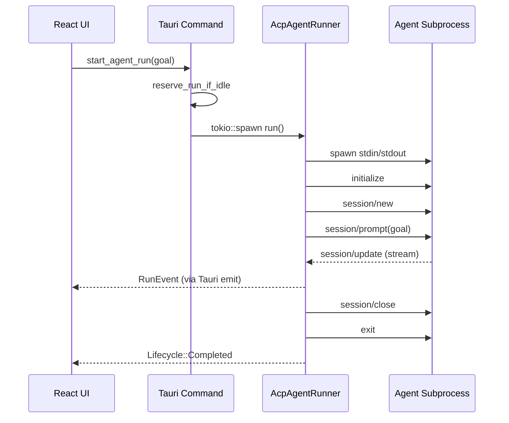
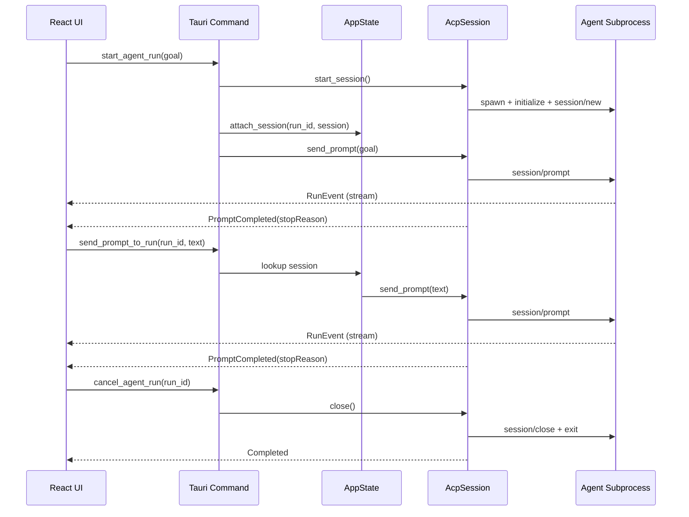

# 실행 중인 에이전트에 추가 프롬프트 전송 기능 설계

## 1. 목표

현재 ACP Agent Workbench는 "Run 버튼 → 초기 goal을 `session/prompt`로 1회 전송 → `session/close` → 프로세스 종료"의 단일 샷 흐름이다. 본 문서는 이를 **"실행 중인 세션에 사용자가 후속 프롬프트를 여러 번 전송할 수 있도록"** 확장하기 위해 필요한 변경사항을 정리한다.

## 2. 현재 구조 요약

### 2.1 Rust 백엔드 주요 경로

| 파일 | 역할 | 현재 제약 |
| --- | --- | --- |
| `src-tauri/src/lib.rs` | Tauri command 등록 (`start_agent_run`, `cancel_agent_run`, `respond_agent_permission` 등) | `send_prompt` 계열 command 없음 |
| `src-tauri/src/adapters/tauri/commands.rs:35-74` | `start_agent_run` 진입점. `tokio::spawn`으로 `RunAgentUseCase` 실행 | tokio `JoinHandle`만 저장, 세션/프로세스 핸들 없음 |
| `src-tauri/src/adapters/tauri/session_state.rs` | `AppState`: `HashMap<run_id, RunSlot>`. `RunSlot::Reserved` / `RunSlot::Running(JoinHandle)` | 동시 실행 1개로 제한 (`reserve_run_if_idle`). 세션 context 미저장 |
| `src-tauri/src/adapters/acp/runner.rs:56-282` | `AcpAgentRunner::run()`. subprocess spawn → `initialize` → `session/new` → `session/prompt(goal)` → `session/close` → cleanup을 한 함수에서 순차 수행 | `RpcPeer`, `session_id`, `Child`가 전부 메서드 로컬 변수 |
| `src-tauri/src/adapters/acp/client.rs` | `RpcPeer` (JSON-RPC request/response + `read_loop`) | 메서드 외부에서 재사용 불가 |
| `src-tauri/src/domain/events.rs` | `RunEvent` enum, `LifecycleStatus` | `PromptSent`는 현재 이벤트 1회만 발생 |

### 2.2 프런트엔드 주요 경로

| 파일 | 역할 | 현재 제약 |
| --- | --- | --- |
| `src/features/agent-run/model.ts` | Zustand store (`goal`, `activeRunId`, `isRunning`, `items`) | 후속 프롬프트용 입력/큐 상태 없음 |
| `src/features/agent-run/useAgentRun.ts` | `run()`, `cancel()` 훅. `listenRunEvents`로 이벤트 수신, lifecycle `completed`/`cancelled` 시 `isRunning=false` | `completed`가 단일 prompt 완료 시점에 발생하므로 follow-up 개념과 충돌 |
| `src/shared/api/tauri.ts` | `startAgentRun`, `cancelAgentRun`, `respondAgentPermission` 등 | `sendPrompt` 래퍼 없음 |
| `src/widgets/run-panel/RunPanel.tsx` | Run/Stop 버튼 UI | 실행 중 추가 입력 UI 없음 |
| `src/features/goal-input/GoalEditor.tsx` | 초기 goal 편집기 | 실행 시작 후에는 추가 전송 수단 없음 |

### 2.3 현재 흐름 (Mermaid)



## 3. 핵심 설계 이슈

| # | 이슈 | 해결 방향 |
| --- | --- | --- |
| A | `AcpAgentRunner::run()`이 모놀리식이라 `RpcPeer`, `session_id`가 외부에 노출되지 않음 | `SessionHandle`을 반환하는 setup 단계와, 프롬프트 전송/대기 단계를 분리 |
| B | `AppState`가 `JoinHandle`만 저장 | `RunContext { join_handle, session_handle, prompt_tx }` 형태로 확장 |
| C | 단일 `session/prompt` 후 곧바로 `session/close` | 최초 goal 전송 후 세션을 열어 두고, 별도 명령으로 추가 프롬프트 전송. 명시적 종료 시점에만 `session/close` |
| D | Lifecycle `Completed`가 "첫 prompt 끝 == 세션 종료" 의미로 쓰임 | `PromptCompleted(stopReason)`와 `SessionClosed` 두 단계로 분리하거나, 기존 enum에 사례 추가 |
| E | 프런트 `isRunning`이 첫 prompt 완료 시 false 로 전환 | 세션 생존 기간과 "응답 대기 중" 상태를 분리 (`sessionActive` + `awaitingResponse`) |
| F | 현재 `reserve_run_if_idle`이 동시 실행을 막음 | 본 기능은 동일 run 내 다중 prompt 이므로 제약 유지 가능. 다만 이미 실행 중인 run 에 대해 follow-up은 허용해야 함 |

## 4. 제안 아키텍처

### 4.1 Rust: 세션을 "살아있는 값"으로 모델링

`src-tauri/src/adapters/acp/runner.rs`를 아래와 같이 분해한다.

```rust
// 새 공개 구조체 (runner.rs 또는 별도 session.rs)
pub struct AcpSession {
    pub session_id: String,
    peer: RpcPeer,
    child: Child,                // kill_on_drop
    read_task: JoinHandle<()>,
    run_id: String,
    client: Arc<AcpClient>,
}

impl AcpSession {
    pub async fn send_prompt(&self, text: String) -> Result<String /* stopReason */>;
    pub async fn close(mut self) -> Result<()>;  // session/close + shutdown + wait
    pub async fn cancel(&self) -> Result<()>;    // session/cancel (ACP 프로토콜)
}
```

`AcpAgentRunner`는 두 가지 진입점을 가진다.

- `start_session(request, run_id, sink) -> Result<AcpSession>`
  - subprocess spawn, `initialize`, `session/new`까지 수행하고 `AcpSession`을 반환
- (기존 `run`은 `start_session` + `send_prompt(initial_goal)` + "대기"의 합성으로 재구성 가능)

read_loop은 현재처럼 `AcpClient`로 이벤트를 emit 하되, session 이 살아있는 한 계속 돌아간다. stdout EOF 시 read_task가 종료되면서 `Lifecycle::Completed(agent_exited)`를 emit 하도록 한다 (이미 25fa75c 커밋에서 비슷한 lifecycle 정렬 작업이 진행됨 — 해당 로직과 합칠 것).

### 4.2 Rust: AppState가 세션을 소유

`src-tauri/src/adapters/tauri/session_state.rs` 확장:

```rust
enum RunSlot {
    Reserved,
    Running(RunContext),
}

pub struct RunContext {
    pub join_handle: JoinHandle<()>,
    pub session: Arc<Mutex<Option<AcpSession>>>,  // Option: close 후 take
}
```

- `attach_session(run_id, session)` 신규 메서드로 `AcpSession`을 주입
- `send_prompt(run_id, text)`는 lock 획득 후 `session.send_prompt(text)` 호출
- `cancel_run`은 세션이 있으면 `session.close()` (graceful) 시도 후 `join_handle.abort()` (타임아웃 시). 단순 `abort`는 subprocess kill_on_drop 에 의존하므로 현재처럼 유지해도 됨 — 다만 session 객체의 Drop이 실행되도록 경로를 정리해야 함

### 4.3 Rust: 새 Tauri Command

`src-tauri/src/adapters/tauri/commands.rs`에 추가:

```rust
#[tauri::command]
pub async fn send_prompt_to_run(
    state: State<'_, AppState>,
    run_id: String,
    prompt: String,
) -> Result<(), String> {
    state
        .send_prompt(&run_id, prompt)
        .await
        .map_err(|e| e.to_string())
}
```

`src-tauri/src/lib.rs`의 `invoke_handler`에 `send_prompt_to_run`을 등록한다.

세부 계약:
- 세션이 없으면 `Err("agent run is not active")`
- 이전 프롬프트 응답이 아직 진행 중인 경우 현재는 병렬 prompt 를 허용하지 않는 ACP 에이전트가 대부분이므로 `Err("agent is still responding")` 로 거절. 판단 기준은 `AcpSession` 내부의 "in_flight" 플래그
- 응답의 `stopReason`은 이벤트 스트림으로 emit 하고 command 자체는 `Ok(())` 만 반환 (프런트가 이벤트로 관찰)

### 4.4 Rust: 도메인 이벤트 확장

`src-tauri/src/domain/events.rs`의 `LifecycleStatus`에 필요 시 단계 추가:

- `PromptSent { index: usize }` — 현재 메시지가 몇 번째 prompt인지 표기 (선택)
- `PromptCompleted { stop_reason: String }` — 한 prompt 의 응답이 종료되었음을 알림 (세션은 유지)
- `Completed` — 세션/프로세스 전체 종료 (기존 의미 유지)

프런트의 `isRunning` 전이 규칙을 분리하기 위함이다.

### 4.5 프런트엔드: 상태 전이 재설계

`src/features/agent-run/model.ts`에 다음 필드 추가:

```ts
sessionActive: boolean;      // 세션이 살아있는 동안 true
awaitingResponse: boolean;   // 최근 prompt 에 대한 응답 대기 중
followUpDraft: string;       // 추가 프롬프트 입력 버퍼
```

- `beginRun()`: `sessionActive=true`, `awaitingResponse=true`
- `PromptCompleted` 수신 시: `awaitingResponse=false`
- `Completed` / `Cancelled` / `Error` 수신 시: `sessionActive=false`, `awaitingResponse=false`
- `send()` 호출 시: `awaitingResponse=true`

기존 `isRunning`은 `sessionActive || awaitingResponse` 파생 값으로 유지하거나, 의미를 좁혀 `sessionActive`로 renaming 한다. 호출부(`useAgentRun`, `RunPanel`)와 함께 일괄 변경.

### 4.6 프런트엔드: Tauri 래퍼 및 훅

`src/shared/api/tauri.ts`:

```ts
export function sendPromptToRun(runId: string, prompt: string) {
  return invoke<void>("send_prompt_to_run", { runId, prompt });
}
```

`src/features/agent-run/useAgentRun.ts`에 `send(text: string)` 함수 추가:

```ts
const send = useCallback(async (text: string) => {
  if (!state.activeRunId || !state.sessionActive) return;
  const trimmed = text.trim();
  if (!trimmed) return;
  state.setAwaitingResponse(true);
  state.setFollowUpDraft("");
  try {
    await sendPromptToRun(state.activeRunId, trimmed);
  } catch (err) {
    state.setAwaitingResponse(false);
    state.setError(String(err));
  }
}, [state]);
```

### 4.7 프런트엔드: UI 변경

- `src/widgets/run-panel/RunPanel.tsx` 또는 별도 위젯(`FollowUpComposer`)으로 세션 활성 시 노출되는 composer 추가
  - multiline textarea + Send 버튼
  - `awaitingResponse === true`일 때 Send 비활성화 + 로딩 표시
  - `Cmd/Ctrl + Enter` 단축키 지원 (선택)
- 기존 `GoalEditor`는 run 시작 전에만 편집 가능하도록 잠그고, 실행 중에는 읽기 전용 요약으로 대체
- 타임라인에는 유저가 보낸 follow-up을 구분할 수 있도록 `TimelineItem`에 `role: "user" | "agent" | ...` 필드가 없다면 추가하고, emit 경로에서 follow-up 전송 시 프런트 로컬에서 `UserPrompt` 항목을 append 한다

### 4.8 변경 후 흐름 (Mermaid)



## 5. 변경 파일 체크리스트

### Rust

- [ ] `src-tauri/src/adapters/acp/runner.rs` — `run()`을 `start_session` + `send_prompt`로 분리, `AcpSession` 도입
- [ ] `src-tauri/src/adapters/acp/client.rs` — `RpcPeer`를 `Clone + Send + Sync`로 계속 쓸 수 있게 유지 (현재 이미 `Arc` 래핑)
- [ ] `src-tauri/src/adapters/acp/mod.rs` — `AcpSession` 재노출
- [ ] `src-tauri/src/adapters/tauri/session_state.rs` — `RunSlot::Running(RunContext)`로 변경, `attach_session`, `send_prompt` 추가
- [ ] `src-tauri/src/adapters/tauri/commands.rs` — `send_prompt_to_run` 신설, `start_agent_run`의 task 내부에서 session attach 후 `send_prompt(goal)` 호출
- [ ] `src-tauri/src/application/` 유스케이스 — `RunAgentUseCase`를 `StartSessionUseCase` + `SendPromptUseCase`로 분리하거나, 최소한 `execute_with_run_id` 인터페이스 조정
- [ ] `src-tauri/src/ports/runner.rs` — port trait도 세션 중심으로 업데이트 (`start_session`, `send_prompt`)
- [ ] `src-tauri/src/domain/events.rs` — `LifecycleStatus`에 `PromptCompleted` 추가
- [ ] `src-tauri/src/lib.rs` — `send_prompt_to_run` command 등록

### Frontend

- [ ] `src/shared/api/tauri.ts` — `sendPromptToRun` 추가
- [ ] `src/entities/message/model.ts` — 새 `LifecycleStatus` 반영, 필요 시 `role` 필드 추가
- [ ] `src/features/agent-run/model.ts` — `sessionActive`, `awaitingResponse`, `followUpDraft` 상태 추가, 전이 규칙 변경
- [ ] `src/features/agent-run/useAgentRun.ts` — `send()` 훅, 이벤트 처리 분기 수정
- [ ] `src/widgets/run-panel/RunPanel.tsx` — Composer 노출 조건, 또는 신규 `FollowUpComposer` 위젯
- [ ] `src/features/goal-input/GoalEditor.tsx` — 실행 중 readonly 처리
- [ ] `src/pages/agent-workbench/` — 레이아웃 내 composer 배치

## 6. 단계별 작업 순서

1. **도메인/이벤트 선정리** — `LifecycleStatus::PromptCompleted` 추가와 프런트 타입 반영 (behavior 변경 없음)
2. **Runner 분해** — `AcpSession` 도입, 기존 `run()`을 `start_session().send_prompt(goal).close()`의 합성으로 재작성하여 기존 동작과 동일한지 통합 확인
3. **AppState 확장** — `RunContext` 도입, cancel/finish 경로 검증
4. **`send_prompt_to_run` command** — 백엔드 신설 및 단위 테스트(가능한 범위에서 mock RpcPeer로)
5. **프런트 상태/훅 확장** — `sessionActive`, `awaitingResponse`, `send()` 구현
6. **UI 추가** — Composer 위젯 및 타임라인 user-role 처리
7. **E2E 수동 검증** — Claude/Codex/OpenCode 에이전트 각각에서 초기 goal → follow-up 2~3회 → cancel 경로 확인

## 7. 위험 및 미결 사항

- ACP 프로토콜에서 한 세션이 복수 `session/prompt`를 연속 수락하는지는 에이전트 구현에 따라 다를 수 있다. 기본 에이전트(`@agentclientprotocol/claude-agent-acp`, `@zed-industries/codex-acp`, `opencode-ai acp`, `pi-acp`) 각각의 동작을 스모크 테스트로 확인 필요.
- `session/cancel`(진행 중 응답 취소) 지원 여부도 확인하여 follow-up 중 "Stop this response only" 버튼을 UI에 노출할지 결정.
- 프롬프트 in-flight 중 follow-up 발송 시 429 유사 거절을 어떻게 UX 처리할지(대기 큐 vs 즉시 거절) 논의 필요. 초기 구현은 "거절"로 단순화.
- 세션을 오래 열어두면 subprocess stdout 버퍼(`stdio_buffer_limit_mb`) 누적 이슈가 생길 수 있음. 기존 limit 로직이 누적 기준인지 라인당 기준인지 확인 필요.
- `auto_allow` 및 권한 브로커 로직은 session-scoped 이므로 기존 동작이 follow-up에도 자연스럽게 적용되는지 회귀 확인.
