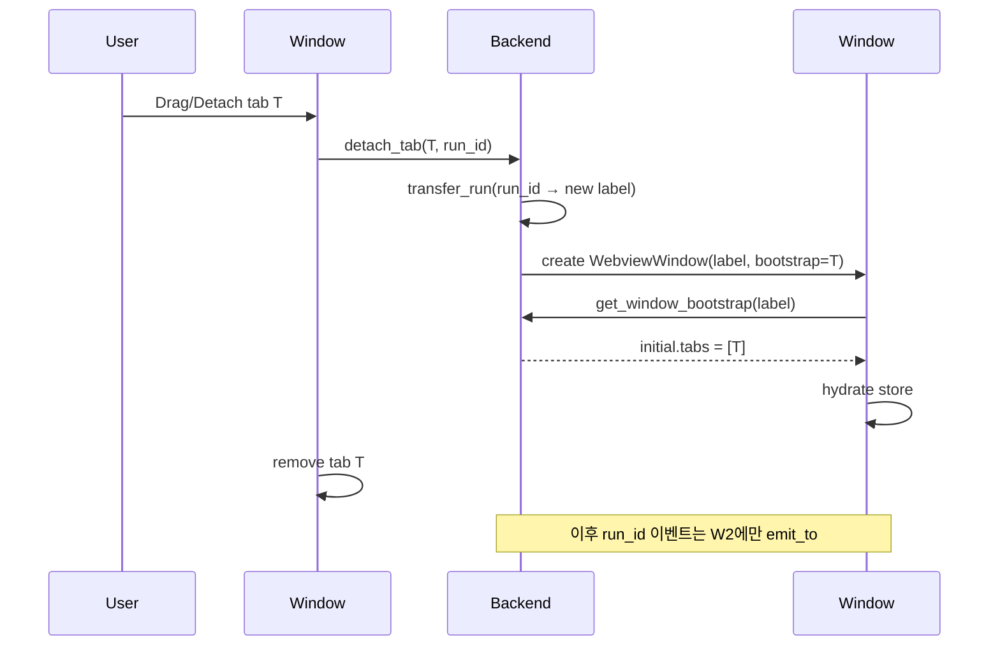

# 탭 → 멀티 창(Window) 확장 설계

## 1. 목표

`multi-agent-tabs-plan.md` 에서 도입한 **단일 창 × 여러 탭** 구조를 **여러 창 × 여러 탭** 구조로 확장한다. 사용자는 아래와 같은 흐름으로 작업할 수 있어야 한다.

- 현재 창의 탭을 "별도 창으로 분리(Detach)" → 실행 중인 run을 끊지 않고 새 창에서 이어감
- 창을 여러 개 띄워 와이드 모니터에 펼치기 — 각 창은 자체 탭 컬렉션을 가짐
- 한 창을 닫아도 다른 창의 run은 정상 동작
- 탭을 다른 창으로 이동(Move)할 수 있으면 더 좋지만 1차 구현에서는 detach만

전제: 멀티 탭 구조(`WorkbenchStore { tabs, activeTabId }`)가 이미 구현되어 있음.

## 2. 배경 및 현재 구조

### 2.1 Tauri 런타임 특성

- Tauri 앱은 하나의 OS 프로세스 안에서 **여러 `WebviewWindow`** 를 띄울 수 있다.
- 모든 윈도우는 **동일한 Rust 백엔드**(`AppState`, tokio runtime)를 공유.
- 각 webview는 **별도의 JS 컨텍스트** — Zustand store는 창마다 독립 인스턴스가 된다 (같은 모듈 코드를 공유해도 state는 공유되지 않음).
- 이벤트 모델:
  - `app.emit("event", payload)` — **모든 윈도우에 브로드캐스트**
  - `window.emit("event", payload)` — 특정 윈도우에만 발송
  - `app.emit_to("label", "event", payload)` — label 기반 단일 윈도우 발송 (Tauri 2.x)
- 창 간 통신은 Rust commands 또는 IPC 이벤트 경유.

### 2.2 현재 코드의 전제

| 파일 | 현재 제약 |
| --- | --- |
| `src-tauri/src/adapters/tauri/event_sink.rs` | `app.emit("agent-run-event", …)` — 전역 브로드캐스트 |
| `src-tauri/src/adapters/tauri/session_state.rs` | run을 `HashMap<run_id, RunSlot>`로 보관. 창 소속은 없음 |
| `src-tauri/src/lib.rs` | 기본 Tauri 설정은 단일 창 |
| `src/app/main.tsx` | 프런트 진입점. 창 별 부팅 로직 없음 |
| `WorkbenchStore` (멀티 탭 단계) | 한 창 안에서만 공유, 창 간 공유 불가 |

현재 브로드캐스트 + 프런트 필터링으로도 대부분 동작하지만, 창 수가 많아질수록 낭비가 커지고 "어떤 창이 어떤 run을 소유하는지" 정보가 없어 **탭 detach / move 가 구현 불가**하다.

## 3. 핵심 설계 이슈

| # | 이슈 | 해결 방향 |
| --- | --- | --- |
| A | 여러 윈도우가 같은 백엔드 상태를 공유하지만 각자 자기 탭만 관리해야 함 | run → 창 소유권(`owner_window_label`)을 백엔드가 보유 |
| B | `app.emit` 브로드캐스트는 비효율 + 보안 (다른 창의 permission payload가 흘러감) | `app.emit_to(owner_label, …)` 로 좁혀 발송 |
| C | 탭 detach 시 실행 중 run을 끊지 않고 새 창에 재연결 | 탭 상태(`TabState`) 직렬화 + 새 창 생성 + 소유권 이전 + 프런트 store에 주입 |
| D | 창을 닫을 때 소유한 run 처리 | 정책: (a) 전부 cancel / (b) "어느 창으로 옮길지" 프롬프트 / (c) 시스템 창 1개 유지 |
| E | 창마다 독립 `WorkbenchStore` | 공통 부팅 시퀀스에서 창 라벨을 읽어 초기 탭 목록을 결정 |
| F | run이 진행 중인 상태에서 소유 창이 크래시하면 고아 run이 됨 | 소유자 없는 run은 백엔드가 자동 cancel 또는 "시스템 창"이 인수 |
| G | macOS / Windows 창 라이프사이클 차이 | macOS는 창 전부 닫혀도 앱 유지, Windows는 종료. 플랫폼별 처리 |
| H | 윈도우 간 브로드캐스트해야 하는 이벤트도 있음 (에이전트 목록 갱신 등) | `emit_to_all` 수동 래퍼 + 이벤트 종류별 라우팅 분리 |
| I | Tauri 이벤트는 label 기반 — 창 라벨 생성 정책 필요 | `workbench-{uuid}` 형식. 첫 창은 `workbench-main` 예약 |

## 4. 제안 아키텍처

### 4.1 백엔드: 창 소유권을 1급 개념으로

`AppState` 확장:

```rust
pub struct AppState {
    runs: Arc<Mutex<HashMap<String, RunSlot>>>,
    run_owners: Arc<Mutex<HashMap<String, String>>>, // run_id → window_label
    permissions: PermissionBroker,
}

impl AppState {
    pub async fn reserve_run(&self, run_id: String, owner: String) -> Result<()> { ... }
    pub async fn owner_of(&self, run_id: &str) -> Option<String> { ... }
    pub async fn transfer_run(&self, run_id: &str, new_owner: String) -> Result<()> { ... }
    pub async fn runs_owned_by(&self, owner: &str) -> Vec<String> { ... }
}
```

### 4.2 백엔드: 타겟 emit

`TauriRunEventSink` 변경:

```rust
pub struct TauriRunEventSink {
    app: AppHandle,
    state: AppState,
}

impl RunEventSink for TauriRunEventSink {
    fn emit(&self, run_id: &str, event: RunEvent) {
        let envelope = RunEventEnvelope { run_id: run_id.into(), event };
        let state = self.state.clone();
        let app = self.app.clone();
        let run_id = run_id.to_string();
        tokio::spawn(async move {
            match state.owner_of(&run_id).await {
                Some(label) => { let _ = app.emit_to(label, "agent-run-event", envelope); }
                None => { let _ = app.emit("agent-run-event", envelope); }
            }
        });
    }
}
```

- owner가 있으면 그 창에만 발송
- 소유자 없는 run(시스템 레벨)은 전역 브로드캐스트 fallback

### 4.3 백엔드: 창 생성/삭제 생명주기 훅

Tauri `WindowEvent::Destroyed` 후크에서:

```rust
app.on_window_event(move |window, event| {
    if let WindowEvent::Destroyed = event {
        let label = window.label().to_string();
        tokio::spawn(async move {
            // 소유 run을 정책대로 처리
            for run_id in state.runs_owned_by(&label).await {
                state.cancel_run(&run_id).await;
            }
        });
    }
});
```

### 4.4 새 Tauri 커맨드

| 커맨드 | 역할 |
| --- | --- |
| `open_workbench_window` | 새 창 생성. 옵션으로 initial tabs payload 전달 |
| `detach_tab(tab: SerializedTab, run_id?: String)` | 새 창 생성 + 해당 run 소유권 이전 + 새 창이 부팅되면 tab payload를 수신 |
| `close_workbench_window` | 프런트가 명시적으로 요청하는 정리 (수동 종료) |
| `list_workbench_windows` | 현재 열린 창 라벨 목록 (탭 move UI용) |

### 4.5 프런트: 창 부팅 시퀀스

`src/app/main.tsx`:

```ts
const windowLabel = await appWindow.label();
const initial = await invoke<WindowBootstrap>("get_window_bootstrap", { label: windowLabel });
installRunEventRouter(windowLabel);
hydrateWorkbenchStore(initial.tabs);
```

- 메인 창은 빈 탭 1개로 부팅
- detach로 생성된 창은 백엔드가 전달한 `initial.tabs` 로 부팅 → 기존 activeRunId 유지

### 4.6 탭 Detach 플로우



실행 중 run(peer, session_id)은 백엔드 쪽에 그대로 있으므로 에이전트 입장에서는 **끊김 없이 이어진다**. 프런트는 소유 창만 바뀐다.

### 4.7 탭 Move (선택 — 후속)

두 창 모두 살아 있는 상태에서 탭 이동.

1. 소스 창이 `move_tab(tab, target_window_label)` 호출
2. 백엔드가 `transfer_run` + target 창에 `ext/tab_arrived` 이벤트 발송
3. target 창이 payload를 store에 append
4. 소스 창이 로컬에서 탭 제거

Detach 이후의 일반화 케이스이므로 detach 안정화 후 개발.

### 4.8 창 닫기 정책

기본:

1. 닫히는 창이 소유한 run 중 실행 중인 것이 있으면 사용자에게 확인
   - `Cancel all runs and close` / `Transfer to main window` / `Abort close`
2. main 창은 최후의 1개로 유지 (macOS 제외 — macOS는 빈 앱 상태 허용)
3. 정책에 따라 `state.cancel_run` 또는 `transfer_run(..., "workbench-main")` 수행

### 4.9 이벤트 라우팅 확장

| 이벤트 | 범위 | 경로 |
| --- | --- | --- |
| `agent-run-event` | 소유 창 only | `app.emit_to(owner_label, …)` |
| `agent-catalog-updated` | 모든 창 | `app.emit(…)` |
| `workbench-window-opened/closed` | 필요 시 특정 창 | `app.emit_to` |

프런트 라우터는 창별로 별도 인스턴스. envelope.runId 기반 dispatch는 멀티 탭 단계와 동일.

## 5. 변경 파일 체크리스트

### Rust

- [ ] `src-tauri/src/adapters/tauri/session_state.rs` — `run_owners` 필드, `reserve_run(run_id, owner)`, `transfer_run`, `runs_owned_by`
- [ ] `src-tauri/src/adapters/tauri/event_sink.rs` — 소유 창 타겟 emit
- [ ] `src-tauri/src/adapters/tauri/commands.rs` — `open_workbench_window`, `detach_tab`, `get_window_bootstrap`, `list_workbench_windows` 추가
- [ ] `src-tauri/src/lib.rs` — 창 생명주기 훅, 커맨드 등록
- [ ] 테스트: 소유권 이전, 소유 창 종료 시 run cleanup

### Frontend

- [ ] `src/app/main.tsx` — 창 라벨 기반 부팅, 라우터 설치
- [ ] `src/app/eventRouter.ts` — emit_to 기반이라 수신 로직은 거의 동일하지만 라벨 로깅 추가
- [ ] `src/features/agent-run/model.ts` — `hydrateFromBootstrap(tabs)` 지원
- [ ] `src/widgets/workbench-tabs/TabItem.tsx` — "Detach to new window" 컨텍스트 메뉴
- [ ] `src/features/workbench/useWindowRegistry.ts` 신설 — 열린 창 목록, move 대상 선택용 (후속)
- [ ] `src/app/styles.css` — 포커스되지 않은 창의 시각 구분(선택)

## 6. 단계별 작업 순서

1. **소유권 개념 도입** — 백엔드 `run_owners` 추가, 기존 단일 창에서 기본값 `workbench-main`로 채움. 이벤트는 아직 전역 브로드캐스트 유지
2. **타겟 emit 전환** — `app.emit_to`로 교체. 테스트에서 소유 창 수신, 비소유 창 미수신 확인
3. **창 생명주기 훅** — 창 닫힘 시 소유 run 자동 cancel. main 창 보호 로직
4. **Detach 기본 구현** — 컨텍스트 메뉴 → 새 창 생성 → bootstrap 주입 → 원래 창에서 탭 제거
5. **창 간 상태 재연결 QA** — detach 직후 follow-up 전송, permission, cancel, idle 타이머 모두 이어지는지 확인
6. **닫기 확인 다이얼로그 / 정책** — 소유 run 있을 때의 UX 결정
7. **(선택) Move 기능** — 다른 창으로 탭 이동 (후속)
8. **(선택) 창 목록 메뉴 / 단축키** — `Cmd/Ctrl+Shift+N` 새 창 등

## 7. 위험 및 미결 사항

### 7.1 리스크 요약

| # | 항목 | 심각도 | 영향 | 완화 방안 |
| --- | --- | --- | --- | --- |
| W1 | 소유자 없는 고아 run | High | 창이 비정상 종료되면 subprocess만 남아 자원 leak | `on_window_event(Destroyed)` 에서 소유 run 자동 cancel. 주기적 garbage collection 백업 |
| W2 | emit_to 실패 (라벨 없음) | Medium | 창이 막 닫히는 타이밍의 envelope이 drop됨 | `app.emit_to` 실패 시 전역 브로드캐스트 fallback + dev 로그 |
| W3 | 창 간 상태 불일치 | Medium | detach 직후 같은 run이 양쪽 창에 보이는 과도기 | detach는 원자적(트랜잭션): transfer + src 탭 제거 + dest hydrate 까지 한 명령에서 처리 |
| W4 | 플랫폼별 창 라이프사이클 차이 | Medium | macOS는 창 전부 닫혀도 앱 유지 / Windows는 종료 | "마지막 창 닫기" 동작을 플랫폼 분기. tauri.conf에서 `preventClose` 활용 |
| W5 | Permission 요청 라우팅 오류 | High | 권한 요청이 소유 창이 아닌 다른 창에 뜨면 자동화 흐름 붕괴 | emit_to 사용 시 라벨 정확성 테스트. 라벨 매핑 누락 시 전역 fallback 대신 명시적 에러 |
| W6 | IPC payload 크기 | Low | 탭을 detach할 때 items 배열을 직렬화 → 큰 세션은 수 MB | detach 시 items는 새 창에서 직접 이벤트 스트림 재수신으로 구성, 설정만 전달 (items는 옵션) |
| W7 | devtools / HMR 멀티 창 | Medium | Vite HMR이 창마다 독립 연결. 개발 중 장애 가능 | dev 스크립트에서 HMR websocket 포트 통일, 리스너 unmount 정리 |
| W8 | 보안 — 창 간 정보 노출 | Medium | 브로드캐스트로 민감 payload 유출 위험 | 전역 emit은 최소화, 기본은 emit_to. 토큰/비밀 포함 이벤트는 절대 브로드캐스트 금지 |
| W9 | 파일 dialog / 모달 소유 | Low | Tauri dialog의 부모 창 지정 실수 시 이상한 창에 뜸 | `tauri_plugin_dialog` 호출 시 현재 창 핸들 명시 |

### 7.2 미결 사항

- 창 닫기 기본 정책 — cancel vs transfer vs prompt 중 어느 것을 default로 할지
- Detach 트리거 UX — 컨텍스트 메뉴만 / 드래그 아웃 제스처까지 지원할지
- 창 레이아웃 영속화 범위 — 창 크기/위치, 탭 순서, 활성 탭을 로컬 저장소에 기록하고 앱 재시작 시 복원할지
- 윈도우 간 drag-and-drop 탭 이동의 플랫폼 지원 (Tauri/OS 제약 확인 필요)
- "시스템 창" 개념을 도입해 모든 run의 백업 소유자로 삼을지 — 단순하지만 UX에 노출되지 않는 hidden window

## 8. 후속 확장

- 창별 다른 에이전트 카탈로그(프로젝트 로컬 카탈로그 오버라이드)
- 창을 Space/데스크톱 단위로 배정해 워크플로우 분리
- 한 창은 "모니터링 전용" — 다른 창에서 실행 중인 run들의 요약만 표시
- 외부 프로세스(예: CI)가 특정 창에 run을 라우팅할 수 있는 CLI 래퍼 (`acp-workbench open-in window-X --agent claude --goal "..."`)
