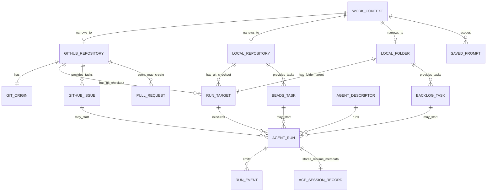
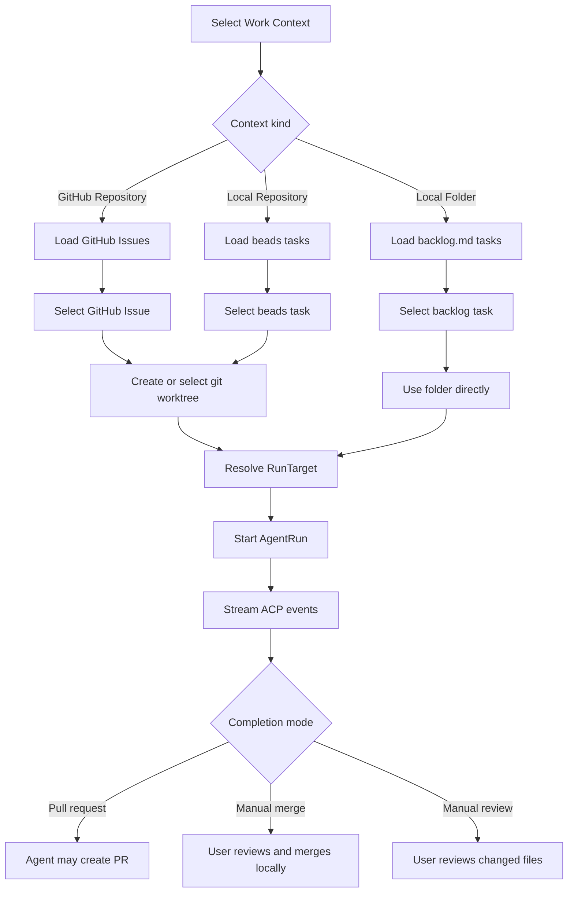

# Work Context 엔티티

## 1. 목적

이 문서는 `GitHub Repository / Local Repository / Local Folder` 용어를 기준으로 ACP Agent Workbench의 핵심 엔티티와 의존관계를 정의한다.

관련 문서:

- `docs/work-context-taxonomy.md`: 제품 용어와 capability를 정의한다.
- 이 문서: 엔티티 경계, 의존관계, Mermaid 관계도를 정의한다.

## 2. 엔티티 정의

### 2.1 WorkContext

`WorkContext`는 agent가 실행될 수 있는 작업 컨텍스트의 내부 상위 개념이다.

사용자에게 직접 노출하는 주 라벨로는 쓰지 않는다. UI에는 다음 중 하나를 표시한다.

- `GitHub Repository`
- `Local Repository`
- `Local Folder`

공통 필드:

```ts
type WorkContextBase = {
  id: string;
  kind: "githubRepository" | "localRepository" | "localFolder";
  name: string;
  rootPath: string;
  createdAt: string;
  updatedAt: string;
};
```

### 2.2 GitHubRepository

`GitHubRepository`는 GitHub origin이 연결된 git repository다.

현재 구현의 `Workspace`는 이 narrower concept에 대응한다.

책임:

- GitHub origin metadata 저장
- 기본 task source로 GitHub Issues 사용
- git worktree 기반 작업 격리 지원
- agent가 pull request 완료 흐름을 수행할 수 있도록 context 제공

책임이 아닌 것:

- PR body/review draft를 앱의 핵심 로컬 엔티티로 관리하지 않는다.
- 수동 PR 생성/리뷰 form을 주 workflow로 노출하지 않는다.

### 2.3 LocalRepository

`LocalRepository`는 GitHub origin을 요구하지 않는 로컬 git repository다.

책임:

- 디스크의 git repository 등록
- beads 같은 로컬 task source 사용
- git worktree 기반 작업 격리 지원
- local commit과 수동 merge workflow 지원

책임이 아닌 것:

- 앱이 pull request를 생성하지 않는다.
- GitHub Issues에 의존하지 않는다.

### 2.4 LocalFolder

`LocalFolder`는 git repository가 아닌 일반 로컬 디렉터리다.

책임:

- 디렉터리를 direct run target으로 등록
- `backlog.md` 같은 파일 기반 task source 사용
- 선택된 폴더에서 agent를 직접 실행

책임이 아닌 것:

- git worktree를 지원하지 않는다.
- branch, commit, push, pull request를 지원하지 않는다.
- 자동 merge workflow를 제공하지 않는다.

### 2.5 GitOrigin

`GitOrigin`은 `GitHubRepository`의 remote repository를 식별한다.

```ts
type GitOrigin = {
  rawUrl: string;
  canonicalUrl: string;
  host: string;
  owner: string;
  repo: string;
};
```

`GitHubRepository`에서는 `host`가 GitHub여야 한다.

### 2.6 RunTarget

`RunTarget`은 agent process가 실제로 실행되는 위치다.

"어떤 작업 컨텍스트인가?"와 "이번 run이 정확히 어느 경로에서 실행되는가?"를 분리한다.

```ts
type RunTarget =
  | {
      kind: "gitCheckout";
      contextId: string;
      checkoutId: string;
      path: string;
      checkoutKind: "clone" | "worktree";
      branch?: string | null;
      headSha?: string | null;
    }
  | {
      kind: "localFolder";
      contextId: string;
      path: string;
    };
```

현재 코드와의 매핑:

| 현재 이름 | 향후 개념 |
| --- | --- |
| `WorkspaceCheckout` | `RunTarget(kind = "gitCheckout")` |
| `AgentRunRequest.cwd` | run 시작 시점의 `RunTarget.path` |
| 등록된 repository 없이 직접 쓰는 `cwd` | `RunTarget(kind = "localFolder")` |

### 2.7 WorkTask

`WorkTask`는 각 context의 issue system에서 선택된 작업이다.

```ts
type WorkTask =
  | {
      source: "githubIssue";
      contextKind: "githubRepository";
      number: number;
      title: string;
      url: string;
      state: "open" | "closed";
    }
  | {
      source: "beads";
      contextKind: "localRepository";
      id: string;
      title: string;
      status: "open" | "in_progress" | "closed";
      blocked: boolean;
    }
  | {
      source: "backlogMd";
      contextKind: "localFolder";
      id: string;
      title: string;
      status: string;
      filePath: string;
    };
```

### 2.8 AgentRun

`AgentRun`은 agent 실행 세션 하나를 의미한다.

의존 대상:

- 선택된 `WorkContext`
- resolve된 `RunTarget`
- 선택 사항인 `WorkTask`
- `AgentDescriptor`
- goal/prompt snapshot

소유하는 runtime state:

- ACP session status
- event stream
- permission state
- follow-up queue
- error state

### 2.9 AcpSessionRecord

`AcpSessionRecord`는 resume 가능한 ACP session metadata를 저장한다.

이 record는 session을 만든 context와 target을 참조해야 한다. 현재 필드는 `workspaceId`, `checkoutId`, `workdir`를 사용하지만, 향후에는 `contextId`, `runTargetId`, `runDirectory`를 선호한다.

### 2.10 SavedPrompt

`SavedPrompt`는 재사용 가능한 prompt snippet을 저장한다.

현재 scope:

- `global`
- `workspace`

향후 scope:

- `global`
- `workContext`

이렇게 하면 prompt를 `GitHubRepository`, `LocalRepository`, `LocalFolder` 모두에 연결할 수 있다.

### 2.11 PullRequest

`PullRequest`는 앱이 직접 관리하는 핵심 엔티티가 아니다.

`GitHubRepository`에서 pull request는 agent가 만들 수 있는 결과물이다. 앱은 run 중 생성된 link나 event message를 보여줄 수 있지만, PR 생성/리뷰 draft를 중심 도메인 모델로 유지하지 않는다.

## 3. Capability 의존성

Capability는 context kind에서 파생한다.

```ts
type WorkContextCapabilities = {
  canUseGit: boolean;
  canCreateWorktree: boolean;
  canCreatePullRequest: boolean;
  canCommit: boolean;
  canPush: boolean;
  requiresManualMerge: boolean;
  requiresManualReview: boolean;
};
```

| Capability | GitHubRepository | LocalRepository | LocalFolder |
| --- | --- | --- | --- |
| `canUseGit` | yes | yes | no |
| `canCreateWorktree` | yes | yes | no |
| `canCreatePullRequest` | yes | no | no |
| `canCommit` | yes | yes | no |
| `canPush` | yes | optional | no |
| `requiresManualMerge` | no | yes | no |
| `requiresManualReview` | no | no | yes |

## 4. Entity Relationship Chart



## 5. Execution Flow Chart



## 6. 현재 구현 매핑

| 현재 구현 | 현재 의미 | 목표 엔티티 |
| --- | --- | --- |
| `src/entities/workspace/model.ts::Workspace` | GitHub origin 기반 repository context | `GitHubRepository` |
| `WorkspaceCheckout` | clone 또는 worktree path | `RunTarget(kind = "gitCheckout")` |
| `RegisteredWorkspace` | GitHub origin repository 등록 결과 | `RegisteredGitHubRepository` |
| `LocalTaskSummary` | beads task summary | `WorkTask(source = "beads")` |
| `AgentRunRequest.workspaceId` | 선택된 repository context | `contextId` |
| `AgentRunRequest.checkoutId` | 선택된 git checkout target | `runTargetId` 또는 git checkout id |
| `AgentRunRequest.cwd` | 실제 run directory | `runDirectory` |
| `SavedPrompt.workspaceId` | repository-scoped prompt | `SavedPrompt.contextId` |
| `PullRequestReviewDraft` | 앱이 관리하는 PR review draft | 제거 후보 |

## 7. Naming Rules

새 코드에는 다음 규칙을 적용한다.

- GitHub origin이 필수이면 `GitHubRepository`를 사용한다.
- git은 필수지만 GitHub가 필수가 아니면 `LocalRepository`를 사용한다.
- git이 필수가 아니면 `LocalFolder`를 사용한다.
- 공유 추상화에만 `WorkContext`를 사용한다.
- 사용자에게 보이는 process cwd에는 `RunDirectory`를 사용한다.
- `cwd`는 protocol 또는 process boundary에서만 사용한다.
- 새 user-facing umbrella term으로 `Workspace`를 쓰지 않는다.

기존 코드는 frontend type, backend domain model, Tauri command, SQLite schema, test를 함께 바꾸는 명시적 migration 전까지 `Workspace*` 이름을 유지할 수 있다.
